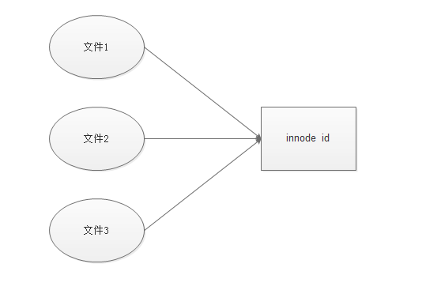

# Inode介绍

我们文件数据存储在硬盘上，硬盘最小的单位是扇区，一个扇区是512个字节。操作系统读取硬盘每次读取4Kb。成为一个块。文件都存在块中。同时操作系统还会有一个区域记录文件的基本信息。这个基本信息成为文件的**元信息**。

## 一、inode信息

元信息存储的位置成为inode、中文名索引节点\(index node\)

inode包括的文件信息如下

\* 文件的字节数

\* 文件拥有者的User ID

\* 文件的Group ID

\* 文件的读、写、执行权限

\* 文件的时间戳，共有三个：ctime指inode上一次变动的时间，mtime指文件内容上一次变动的时间，atime指文件上一次打开的时间。

\* 链接数，即有多少文件名指向这个inode

\* 文件数据block的位置

## 二、inode大小

inode也是存储在硬盘上。需要耗费硬盘空间。

每个inode节点的大小，一般是128字节或256字节。inode节点的总数，在格式化时就给定，一般是每1KB或每2KB就设置一个inode

可以使用

```text
df -i
Filesystem      Inodes  IUsed   IFree IUse% Mounted on
/dev/vda1      2621440 262203 2359237   11% /
tmpfs           128788      2  128786    1% /dev/shm
```

## 三、inode id

每个inode都有一个id。操作系统根据这个id识别文件

类似人的身份证号。我们通过识别身份证来区别人。人名只是一个称号。

打开文件，一般会有三步，

* 找到inode 的id
* 获取**inode**信息
* 找到文件数据所在的块。读取内容

## 四、目录文件

目录也是一种文件。linux一切都是文件。目录文件的读权限（r）和写权限（w），都是针对目录文件本身。由于目录文件内只有文件名和inode号码

## 五、硬链接

一般情况，文件名和**inode** id是一对 一的关系。但是linux下允许多个文件名指向一个**innode** id

可以用不同的文件名访问同样的内容；对文件内容进行修改，会影响到所有文件名。这种情况就被称为"硬链接"（hard link）。



```text
ln 源文件 目标文件
```

运行上面这条命令以后，源文件与目标文件的inode号码相同，都指向同一个inode。inode信息中有一项叫做"链接数"，记录指向该inode的文件名总数，这时就会增加1。

这个就像PHP的zval结构。zval中含有一个refcount 和一个is\_ref.当有引用的时候。会让ref\_count+1.is\_ref设置1。

## 六、软链接

文件A和文件B的inode号码虽然不一样，但是文件A的内容是文件B的路径。读取文件A时，系统会自动将访问者导向文件B。因此，无论打开哪一个文件，最终读取的都是文件B。这时，文件A就称为文件B的"软链接"（soft link）或者"符号链接（symbolic link）。这种就是类似windows下的快捷方式。

```text
ln -s 源文文件或目录 目标文件或目录
```

